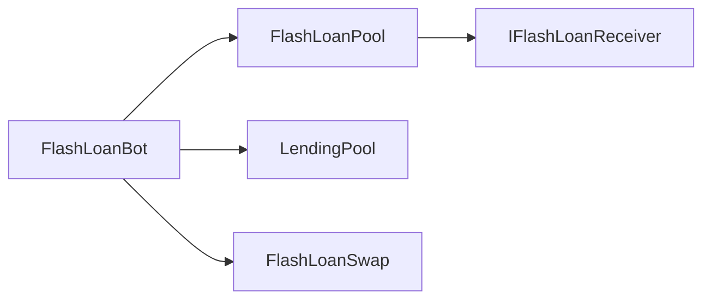

# Flashloan

## Recent Changes

## Overview

The flashloan stack contains a funding pool, a swap helper, a receiver interface, and a liquidation bot that uses a flash loan to repay debt, seize collateral, optionally swap it, and repay the flash loan.

## FlashLoanPool

Holds Alice and Bob liquidity and sends flash loans.

### Getters

- `aliceToken() -> address`
  File: `contracts/Flashloan/FlashLoanPool.sol`
  Returns: supported Alice token address.

- `bobToken() -> address`
  File: `contracts/Flashloan/FlashLoanPool.sol`
  Returns: supported Bob token address.

- `feeRate() -> uint256`
  File: `contracts/Flashloan/FlashLoanPool.sol`
  Returns: flash-loan fee rate in basis points.

- `FEE_BASE() -> uint256`
  File: `contracts/Flashloan/FlashLoanPool.sol`
  Returns: fee denominator, constant `10000`.

- `owner() -> address`
  File: `contracts/Flashloan/FlashLoanPool.sol`
  Returns: contract owner.

- `getBalance(address token) -> uint256`
  File: `contracts/Flashloan/FlashLoanPool.sol`
  Inputs: `token`: supported token address.
  Returns: pool balance of that token.

### Functions

- `deposit(address token, uint256 amount)`
  File: `contracts/Flashloan/FlashLoanPool.sol`
  Purpose: deposit supported token liquidity into the flash-loan pool.
  Inputs: `token`: supported token address. `amount`: token amount.

- `flashLoan(address token, uint256 amount, address target, bytes data)`
  File: `contracts/Flashloan/FlashLoanPool.sol`
  Purpose: lend tokens atomically and invoke the receiver callback on `target`.
  Inputs: `token`: flash-loaned token address. `amount`: loan amount. `target`: receiver contract address. `data`: callback payload.

### Setters

- `withdraw(address token, uint256 amount)` (OnlyOwner)
  File: `contracts/Flashloan/FlashLoanPool.sol`
  Purpose: withdraw supported token liquidity from the flash-loan pool.
  Inputs: `token`: supported token address. `amount`: token amount.

- `setFeeRate(uint256 _feeRate)` (OnlyOwner)
  File: `contracts/Flashloan/FlashLoanPool.sol`
  Purpose: update the flash-loan fee rate.
  Inputs: `_feeRate`: fee rate in basis points.
  Notes: `_feeRate` must be less than or equal to `500`.

## IFlashLoanReceiver

The callback interface that flash-loan receivers implement.

### Functions

- `executeOperation(address token, uint256 amount, uint256 fee, address initiator, bytes data) -> bool`
  File: `contracts/Flashloan/FlashLoanPool.sol`
  Purpose: callback function that flash-loan receiver contracts must implement.
  Inputs: `token`: flash-loaned token address. `amount`: loan amount. `fee`: required fee. `initiator`: original caller of `flashLoan`. `data`: arbitrary callback payload.
  Returns: `true` when the receiver flow succeeds.

## FlashLoanBot

Uses a flash loan to liquidate one debt vault and repay in the same transaction.

### Getters

- `flashPool() -> address`
  File: `contracts/Flashloan/FlashLoanBot.sol`
  Returns: linked flash-loan pool address.

- `lendingPool() -> address`
  File: `contracts/Flashloan/FlashLoanBot.sol`
  Returns: linked lending-pool address.

- `swap() -> address`
  File: `contracts/Flashloan/FlashLoanBot.sol`
  Returns: linked swap address.

### Functions

- `borrow(address token, uint256 amount, uint256 debtVaultId, address collateralAsset)`
  File: `contracts/Flashloan/FlashLoanBot.sol`
  Purpose: trigger the flash-loan liquidation strategy against one debt vault.
  Inputs: `token`: flash-loaned debt asset. `amount`: flash-loan amount. `debtVaultId`: target debt-vault id. `collateralAsset`: collateral asset to seize and possibly swap.

- `executeOperation(address token, uint256 amount, uint256 fee, address initiator, bytes data) -> bool`
  File: `contracts/Flashloan/FlashLoanBot.sol`
  Purpose: handle the flash-loan callback, run liquidation, process collateral, and repay the flash loan.
  Inputs: `token`: flash-loaned debt asset. `amount`: loan amount. `fee`: flash-loan fee. `initiator`: original flash-loan caller. `data`: encoded `(debtVaultId, collateralAsset)` payload.
  Returns: `true` when liquidation and repayment succeed.

### Notes

- The bot targets a `debtVaultId`, not a borrower wallet address.
- Seized collateral first appears as newly claimable shares in `LendingPool` custody, then gets withdrawn as underlying before any optional swap.

## FlashLoanSwap

A simple Alice-BOB swap used by the flash-loan bot after liquidation.

### Getters

- `aliceToken() -> address`
  File: `contracts/Flashloan/FlashLoanSwap.sol`
  Returns: configured Alice token address.

- `bobToken() -> address`
  File: `contracts/Flashloan/FlashLoanSwap.sol`
  Returns: configured Bob token address.

- `exchangeRate() -> uint256`
  File: `contracts/Flashloan/FlashLoanSwap.sol`
  Returns: current swap exchange rate scaled by `1e18`.

- `owner() -> address`
  File: `contracts/Flashloan/FlashLoanSwap.sol`
  Returns: swap owner address.

- `totalAliceSwapped() -> uint256`
  File: `contracts/Flashloan/FlashLoanSwap.sol`
  Returns: cumulative Alice volume swapped through the contract.

- `totalBobSwapped() -> uint256`
  File: `contracts/Flashloan/FlashLoanSwap.sol`
  Returns: cumulative Bob volume swapped through the contract.

- `getAliceToBobAmount(uint256 aliceAmount) -> uint256`
  File: `contracts/Flashloan/FlashLoanSwap.sol`
  Inputs: `aliceAmount`: Alice input amount.
  Returns: quoted Bob output amount.

- `getBobToAliceAmount(uint256 bobAmount) -> uint256`
  File: `contracts/Flashloan/FlashLoanSwap.sol`
  Inputs: `bobAmount`: Bob input amount.
  Returns: quoted Alice output amount.

- `getPoolStatus() -> (uint256 aliceBalance, uint256 bobBalance)`
  File: `contracts/Flashloan/FlashLoanSwap.sol`
  Returns: current Alice and Bob liquidity balances held by the swap.

- `getStats() -> (uint256 aliceTotal, uint256 bobTotal)`
  File: `contracts/Flashloan/FlashLoanSwap.sol`
  Returns: cumulative Alice and Bob swap volumes.

### Functions

- `swapAliceToBob(uint256 aliceAmount)`
  File: `contracts/Flashloan/FlashLoanSwap.sol`
  Purpose: swap Alice input for Bob output at the current exchange rate.
  Inputs: `aliceAmount`: Alice input amount.

- `swapBobToAlice(uint256 bobAmount)`
  File: `contracts/Flashloan/FlashLoanSwap.sol`
  Purpose: swap Bob input for Alice output at the current exchange rate.
  Inputs: `bobAmount`: Bob input amount.

### Setters

- `addLiquidity(address token, uint256 amount)` (OnlyOwner)
  File: `contracts/Flashloan/FlashLoanSwap.sol`
  Purpose: add swap liquidity for one supported token.
  Inputs: `token`: supported token address. `amount`: token amount.

- `removeLiquidity(address token, uint256 amount)` (OnlyOwner)
  File: `contracts/Flashloan/FlashLoanSwap.sol`
  Purpose: remove swap liquidity for one supported token.
  Inputs: `token`: supported token address. `amount`: token amount.

- `setExchangeRate(uint256 _exchangeRate)` (OnlyOwner)
  File: `contracts/Flashloan/FlashLoanSwap.sol`
  Purpose: update the swap exchange rate.
  Inputs: `_exchangeRate`: rate scaled by `1e18`.
