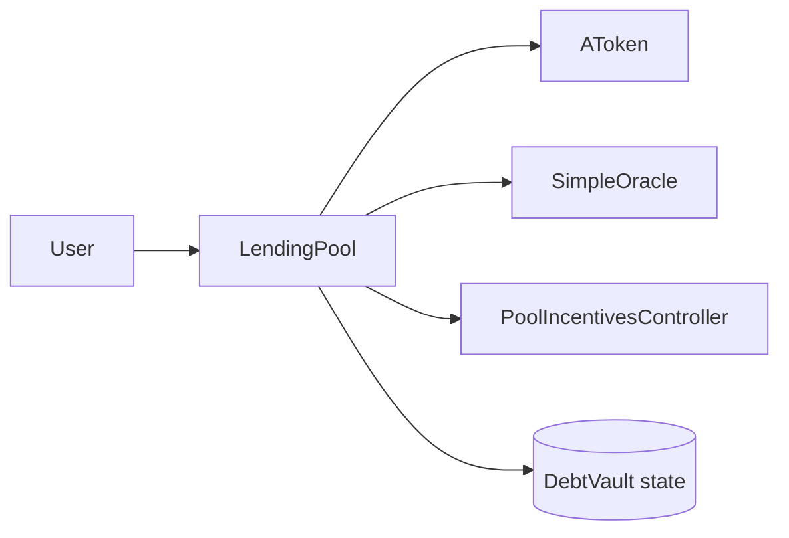

# LendingPool

## Recent Changes

## Overview

`LendingPool` is the main protocol entry contract. It owns reserve onboarding, deposit custody, debt-vault lifecycle, borrowing, repayment, liquidation, reserve-fee accounting, and reward-action forwarding.

## Getters

### Constants And State

- `RAY() -> uint256`
  File: `contracts/LendingPool.sol`
  Returns: fixed-point base unit, constant `1e18`.

- `BPS() -> uint256`
  File: `contracts/LendingPool.sol`
  Returns: basis-point denominator, constant `10_000`.

- `DEFAULT_RESERVE_FACTOR_BPS() -> uint256`
  File: `contracts/LendingPool.sol`
  Returns: default reserve factor used by the 8-argument `addReserve`, constant `500`.

- `DEPOSIT_REWARD_TYPE() -> uint8`
  File: `contracts/LendingPool.sol`
  Returns: deposit-side reward type id, constant `0`.

- `BORROW_REWARD_TYPE() -> uint8`
  File: `contracts/LendingPool.sol`
  Returns: borrow-side reward type id, constant `1`.

- `oracle() -> address`
  File: `contracts/LendingPool.sol`
  Returns: current oracle contract address.

- `poolIncentivesController() -> address`
  File: `contracts/LendingPool.sol`
  Returns: incentives controller address.

- `treasury() -> address`
  File: `contracts/LendingPool.sol`
  Returns: treasury address currently receiving protocol liquidation-bonus cut shares by default.

- `liquidationBonus() -> uint256`
  File: `contracts/LendingPool.sol`
  Returns: liquidation bonus in basis points.

- `protocolLiquidationCutBps() -> uint256`
  File: `contracts/LendingPool.sol`
  Returns: protocol share of liquidation bonus in basis points.

- `closeFactor() -> uint256`
  File: `contracts/LendingPool.sol`
  Returns: max repay portion allowed in one liquidation, in basis points.

- `nextDebtVaultId() -> uint256`
  File: `contracts/LendingPool.sol`
  Returns: next debt-vault id to be assigned.

### Reserve

- `isReserveAsset(address asset) -> bool`
  File: `contracts/LendingPool.sol`
  Inputs: `asset`: token address.
  Returns: whether the asset has been registered as a reserve.

- `getReserveAToken(address asset) -> address`
  File: `contracts/LendingPool.sol`
  Inputs: `asset`: reserve asset.
  Returns: reserve-specific aToken address.

- `getReserveAssets() -> address[]`
  File: `contracts/LendingPool.sol`
  Returns: list of all registered reserve assets.

- `getReserveUtilization(address asset) -> uint256`
  File: `contracts/LendingPool.sol`
  Inputs: `asset`: reserve asset.
  Returns: current reserve utilization scaled by `1e18`.

- `getReserveFactorBps(address asset) -> uint256`
  File: `contracts/LendingPool.sol`
  Inputs: `asset`: reserve asset.
  Returns: reserve-level protocol spread factor in basis points.

- `getAccruedProtocolFees(address asset) -> uint256`
  File: `contracts/LendingPool.sol`
  Inputs: `asset`: reserve asset.
  Returns: accrued but uncollected protocol fees in underlying amount.

### DebtVault

- `getOwnerDebtVaultIds(address owner_) -> uint256[]`
  File: `contracts/LendingPool.sol`
  Inputs: `owner_`: wallet address.
  Returns: debt-vault ids owned by that address.

- `getDebtVaultHealthFactor(uint256 debtVaultId) -> uint256`
  File: `contracts/LendingPool.sol`
  Inputs: `debtVaultId`: debt-vault id.
  Returns: same value as `healthFactor`; returns `uint256.max` when the vault has no debt.

- `getDebtVaultValues(uint256 debtVaultId) -> (uint256 maxBorrowableValue, uint256 liquidationThresholdValue, uint256 debtValue)`
  File: `contracts/LendingPool.sol`
  Inputs: `debtVaultId`: debt-vault id.
  Returns: max borrowable value, liquidation-threshold-adjusted collateral value, and debt value.

- `getDebtVaultSummary(uint256 debtVaultId) -> (address borrower, bool active, uint256 hf, uint256 liquidationThresholdValue, uint256 debtValue, uint256 maxBorrowableValue)`
  File: `contracts/LendingPool.sol`
  Inputs: `debtVaultId`: debt-vault id.
  Returns: borrower, active flag, health factor, liquidation-threshold value, debt value, and max borrowable value.

- `getDebtVaultCollateralShares(uint256 debtVaultId, address asset) -> uint256`
  File: `contracts/LendingPool.sol`
  Inputs: `debtVaultId`: debt-vault id. `asset`: reserve asset.
  Returns: collateral shares locked for that vault and asset.

- `getDebtVaultCollateralAssetAmount(uint256 debtVaultId, address asset) -> uint256`
  File: `contracts/LendingPool.sol`
  Inputs: `debtVaultId`: debt-vault id. `asset`: reserve asset.
  Returns: current underlying collateral amount for that vault and asset.

- `getDebtVaultDebtAmount(uint256 debtVaultId, address asset) -> uint256`
  File: `contracts/LendingPool.sol`
  Inputs: `debtVaultId`: debt-vault id. `asset`: borrowed asset.
  Returns: current debt amount for that vault and asset.

- `getDebtVaultCollateralAssets(uint256 debtVaultId) -> address[]`
  File: `contracts/LendingPool.sol`
  Inputs: `debtVaultId`: debt-vault id.
  Returns: collateral asset list of the vault.

- `getDebtVaultBorrowedAssets(uint256 debtVaultId) -> address[]`
  File: `contracts/LendingPool.sol`
  Inputs: `debtVaultId`: debt-vault id.
  Returns: borrowed asset list of the vault.

- `getLiquidationTables() -> (LiquidationTable[] memory)`
  File: `contracts/LendingPool.sol`
  Returns: array of unhealthy vault snapshots, each containing `debtVaultId`, `borrower`, `healthFactor`, `debtValue`, and `collateralValue`, where `collateralValue` is currently the liquidation-threshold-adjusted collateral value rather than the raw collateral market value.

### User

- `getUserCustodiedShares(address user, address asset) -> uint256`
  File: `contracts/LendingPool.sol`
  Inputs: `user`: wallet address. `asset`: reserve asset.
  Returns: aToken shares held in pool custody for the user.

- `getUserLockedShares(address user, address asset) -> uint256`
  File: `contracts/LendingPool.sol`
  Inputs: `user`: wallet address. `asset`: reserve asset.
  Returns: custodied shares currently locked as collateral.

- `getUserClaimableShares(address user, address asset) -> uint256`
  File: `contracts/LendingPool.sol`
  Inputs: `user`: wallet address. `asset`: reserve asset.
  Returns: custodied shares that are not locked and can be claimed out to the wallet.

- `getUserCustodiedAssetAmount(address user, address asset) -> uint256`
  File: `contracts/LendingPool.sol`
  Inputs: `user`: wallet address. `asset`: reserve asset.
  Returns: underlying asset amount reconstructed from the user's custodied shares.

- `getUserLockedAssetAmount(address user, address asset) -> uint256`
  File: `contracts/LendingPool.sol`
  Inputs: `user`: wallet address. `asset`: reserve asset.
  Returns: underlying asset amount reconstructed from the user's locked shares.

- `getUserClaimableAssetAmount(address user, address asset) -> uint256`
  File: `contracts/LendingPool.sol`
  Inputs: `user`: wallet address. `asset`: reserve asset.
  Returns: underlying asset amount reconstructed from the user's claimable shares.

- `getUserTotalDepositAssetAmount(address user, address asset) -> uint256`
  File: `contracts/LendingPool.sol`
  Inputs: `user`: wallet address. `asset`: reserve asset.
  Returns: total deposit exposure as underlying amount, including pool-custodied shares and wallet-held aToken shares.

- `getUserDebtBalance(address user, address asset) -> uint256`
  File: `contracts/LendingPool.sol`
  Inputs: `user`: wallet address. `asset`: reserve asset.
  Returns: total debt amount of that asset across all vaults owned by the user.

- `getUserDebtPrincipal(address user, address asset) -> uint256`
  File: `contracts/LendingPool.sol`
  Inputs: `user`: wallet address. `asset`: reserve asset.
  Returns: aggregated normalized debt principal, also used as the user's scaled debt for that asset.

- `getUserDebtAmount(address user, address asset) -> uint256`
  File: `contracts/LendingPool.sol`
  Inputs: `user`: wallet address. `asset`: reserve asset.
  Returns: current debt amount reconstructed from the user's aggregated debt principal.

## Functions

### Deposit And Wallet

- `deposit(address asset, uint256 amount)`
  File: `contracts/LendingPool.sol`
  Purpose: deposit reserve asset into the pool and mint custodied aToken shares for the caller.
  Inputs: `asset`: reserve asset. `amount`: underlying asset amount.

- `withdraw(address asset, uint256 amount)`
  File: `contracts/LendingPool.sol`
  Purpose: withdraw underlying asset from the caller's claimable deposited balance.
  Inputs: `asset`: reserve asset. `amount`: underlying asset amount.

- `claimAToken(address asset, uint256 shares, address to)`
  File: `contracts/LendingPool.sol`
  Purpose: move claimable custodied aToken shares out to a wallet.
  Inputs: `asset`: reserve asset. `shares`: aToken share amount. `to`: receiver address.

- `recustodyAToken(address asset, uint256 shares)`
  File: `contracts/LendingPool.sol`
  Purpose: move wallet-held aToken shares back into pool custody.
  Inputs: `asset`: reserve asset. `shares`: aToken share amount.

### DebtVault Lifecycle

- `openDebtVault() -> uint256`
  File: `contracts/LendingPool.sol`
  Purpose: create a new debt vault for the caller.
  Returns: new debt-vault id.

- `depositCollateral(uint256 debtVaultId, address asset, uint256 amount)`
  File: `contracts/LendingPool.sol`
  Purpose: move deposited balance into one debt vault as collateral.
  Inputs: `debtVaultId`: debt-vault id. `asset`: collateral asset. `amount`: underlying asset amount converted from deposited balance.

- `withdrawCollateral(uint256 debtVaultId, address asset, uint256 amount)`
  File: `contracts/LendingPool.sol`
  Purpose: move collateral out of one debt vault back into normal deposited balance if the vault remains healthy.
  Inputs: `debtVaultId`: debt-vault id. `asset`: collateral asset. `amount`: underlying asset amount converted from collateral.

### Borrow And Repay

- `borrow(uint256 debtVaultId, address asset, uint256 amount)`
  File: `contracts/LendingPool.sol`
  Purpose: borrow one reserve asset against one debt vault.
  Inputs: `debtVaultId`: debt-vault id. `asset`: borrowed asset. `amount`: underlying asset amount.

- `repay(uint256 debtVaultId, address asset, uint256 amount)`
  File: `contracts/LendingPool.sol`
  Purpose: repay one reserve debt inside one debt vault.
  Inputs: `debtVaultId`: debt-vault id. `asset`: debt asset. `amount`: requested repay amount.

### Liquidation

- `liquidate(uint256 debtVaultId, address debtAsset, address collateralAsset, uint256 repayAmount)`
  File: `contracts/LendingPool.sol`
  Purpose: liquidate an unhealthy debt vault by repaying one debt asset and seizing one collateral asset.
  Inputs: `debtVaultId`: target debt-vault id. `debtAsset`: asset being repaid. `collateralAsset`: collateral being seized. `repayAmount`: requested repay amount.

## Setters And Admin Functions (OnlyOwner)

- `addReserve(address asset, address interestRateModel, bool canBeCollateral, bool canBeBorrowed, uint256 ltv, uint256 liquidationThreshold, string aTokenName, string aTokenSymbol)`
  File: `contracts/LendingPool.sol`
  Purpose: register a new reserve and deploy its aToken using `DEFAULT_RESERVE_FACTOR_BPS`.
  Inputs: `asset`: reserve asset. `interestRateModel`: rate-model contract address. `canBeCollateral`: whether the asset can be used as collateral. `canBeBorrowed`: whether the asset can be borrowed. `ltv`: loan-to-value ratio. `liquidationThreshold`: liquidation threshold ratio. `aTokenName`: aToken name. `aTokenSymbol`: aToken symbol.

- `addReserve(address asset, address interestRateModel, bool canBeCollateral, bool canBeBorrowed, uint256 ltv, uint256 liquidationThreshold, string aTokenName, string aTokenSymbol, uint256 reserveFactorBps_)`
  File: `contracts/LendingPool.sol`
  Purpose: register a new reserve and deploy its aToken with an explicit reserve factor.
  Inputs: `asset`: reserve asset. `interestRateModel`: rate-model contract address. `canBeCollateral`: whether the asset can be used as collateral. `canBeBorrowed`: whether the asset can be borrowed. `ltv`: loan-to-value ratio. `liquidationThreshold`: liquidation threshold ratio. `aTokenName`: aToken name. `aTokenSymbol`: aToken symbol. `reserveFactorBps_`: protocol spread factor in basis points.

- `setReserveConfig(address asset, bool canBeCollateral, bool canBeBorrowed, uint256 ltv, uint256 liquidationThreshold)`
  File: `contracts/LendingPool.sol`
  Purpose: update reserve risk flags and thresholds.
  Inputs: `asset`: reserve asset. `canBeCollateral`: new collateral flag. `canBeBorrowed`: new borrow flag. `ltv`: new loan-to-value ratio. `liquidationThreshold`: new liquidation threshold ratio.
  Notes: `ltv` must be less than or equal to `liquidationThreshold`, and `liquidationThreshold` must be less than or equal to `RAY`.

- `setOracle(address newOracle)`
  File: `contracts/LendingPool.sol`
  Purpose: update the oracle contract.
  Inputs: `newOracle`: new oracle address.

- `setPoolIncentivesController(address newController)`
  File: `contracts/LendingPool.sol`
  Purpose: update the incentives controller contract used by the pool.
  Inputs: `newController`: controller address.

- `setTreasury(address newTreasury)`
  File: `contracts/LendingPool.sol`
  Purpose: update the treasury address.
  Inputs: `newTreasury`: non-zero treasury address.

- `setReserveFactorBps(address asset, uint256 bps_)`
  File: `contracts/LendingPool.sol`
  Purpose: update reserve-level protocol spread factor.
  Inputs: `asset`: reserve asset. `bps_`: reserve factor in basis points.
  Notes: `bps_` must be less than or equal to `BPS`.

- `setProtocolLiquidationCutBps(uint256 bps_)`
  File: `contracts/LendingPool.sol`
  Purpose: update protocol share of liquidation bonus.
  Inputs: `bps_`: liquidation-bonus cut in basis points.
  Notes: `bps_` must be less than or equal to `BPS`.

- `setInterestRateModel(address asset, address newModel)`
  File: `contracts/LendingPool.sol`
  Purpose: update the reserve interest-rate model.
  Inputs: `asset`: reserve asset. `newModel`: new model address.

- `setLiquidationBonus(uint256 _bonus)`
  File: `contracts/LendingPool.sol`
  Purpose: update liquidation bonus.
  Inputs: `_bonus`: liquidation bonus in basis points.
  Notes: `_bonus` must be less than or equal to `3000`.

- `setCloseFactor(uint256 _closeFactor)`
  File: `contracts/LendingPool.sol`
  Purpose: update close factor.
  Inputs: `_closeFactor`: close factor in basis points.
  Notes: `_closeFactor` must be less than or equal to `BPS`.

- `fundReserve(address asset, uint256 amount)`
  File: `contracts/LendingPool.sol`
  Purpose: add extra underlying liquidity to a reserve without minting user aToken shares.
  Inputs: `asset`: reserve asset. `amount`: underlying asset amount.

- `collectProtocolFees(address asset, uint256 amount, address to)`
  File: `contracts/LendingPool.sol`
  Purpose: transfer accrued protocol fees of one reserve to a receiver.
  Inputs: `asset`: reserve asset. `amount`: underlying asset amount. `to`: receiver address.

## Notes

- `withdraw` and `repay` report reward actions into `PoolIncentivesController` before user balances change.
- `getUserTotalDepositAssetAmount` includes both pool-custodied shares and wallet-held aToken shares.
- `getUserDebtPrincipal` is the normalized debt state used to reconstruct current debt with the latest borrow index.
- If a vault has no debt, `healthFactor` and `getDebtVaultHealthFactor` return `uint256.max`.
- In `getLiquidationTables`, `collateralValue` currently stores the liquidation-threshold-adjusted collateral value, not the raw collateral market value. The field name and the stored semantics do not fully match.
