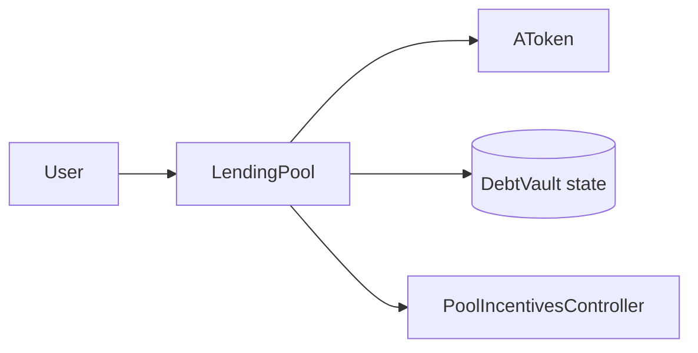

# LendingPool

## Recent Changes

## Overview

This document only lists the interfaces the frontend is expected to call directly for reserve browsing, deposit and custody actions, debt-vault operations, liquidation UX, and reward-aware balance display.

## Getters

### Constants And State

- `RAY() -> uint256`
  File: `contracts/LendingPool.sol`
  Returns: fixed-point base unit, constant `1e18`.

- `BPS() -> uint256`
  File: `contracts/LendingPool.sol`
  Returns: basis-point denominator, constant `10_000`.

- `oracle() -> address`
  File: `contracts/LendingPool.sol`
  Returns: current oracle contract address.

- `liquidationBonus() -> uint256`
  File: `contracts/LendingPool.sol`
  Returns: liquidation bonus in basis points.

- `closeFactor() -> uint256`
  File: `contracts/LendingPool.sol`
  Returns: close factor in basis points.

- `nextDebtVaultId() -> uint256`
  File: `contracts/LendingPool.sol`
  Returns: next debt-vault id to be assigned.

- `poolIncentivesController() -> address`
  File: `contracts/LendingPool.sol`
  Returns: linked incentives controller address.

### Reserve

- `getReserveAssets() -> address[]`
  File: `contracts/LendingPool.sol`
  Returns: all supported reserve assets.

- `getReserveUtilization(address asset) -> uint256`
  File: `contracts/LendingPool.sol`
  Inputs: `asset`: reserve asset.
  Returns: current reserve utilization scaled by `1e18`.

- `getReserveAToken(address asset) -> address`
  File: `contracts/LendingPool.sol`
  Inputs: `asset`: reserve asset.
  Returns: reserve-specific aToken address.

### DebtVault

- `getOwnerDebtVaultIds(address owner_) -> uint256[]`
  File: `contracts/LendingPool.sol`
  Inputs: `owner_`: wallet address.
  Returns: debt-vault ids owned by that address.

- `getDebtVaultHealthFactor(uint256 debtVaultId) -> uint256`
  File: `contracts/LendingPool.sol`
  Inputs: `debtVaultId`: debt-vault id.
  Returns: same value as `healthFactor`; returns `uint256.max` when the vault has no debt.

- `getDebtVaultValues(uint256 debtVaultId) -> (uint256 maxBorrowableValue, uint256 liquidationThresholdValue, uint256 debtValue)`
  File: `contracts/LendingPool.sol`
  Inputs: `debtVaultId`: debt-vault id.
  Returns: max borrowable value, liquidation-threshold value, and debt value.

- `getDebtVaultSummary(uint256 debtVaultId) -> (address borrower, bool active, uint256 hf, uint256 liquidationThresholdValue, uint256 debtValue, uint256 maxBorrowableValue)`
  File: `contracts/LendingPool.sol`
  Inputs: `debtVaultId`: debt-vault id.
  Returns: borrower, active flag, health factor, liquidation-threshold value, debt value, and max borrowable value.

- `getDebtVaultCollateralShares(uint256 debtVaultId, address asset) -> uint256`
  File: `contracts/LendingPool.sol`
  Inputs: `debtVaultId`: debt-vault id. `asset`: reserve asset.
  Returns: locked collateral shares.

- `getDebtVaultCollateralAssetAmount(uint256 debtVaultId, address asset) -> uint256`
  File: `contracts/LendingPool.sol`
  Inputs: `debtVaultId`: debt-vault id. `asset`: reserve asset.
  Returns: current collateral amount as underlying asset.

- `getDebtVaultDebtAmount(uint256 debtVaultId, address asset) -> uint256`
  File: `contracts/LendingPool.sol`
  Inputs: `debtVaultId`: debt-vault id. `asset`: borrowed asset.
  Returns: current debt amount.

- `getDebtVaultCollateralAssets(uint256 debtVaultId) -> address[]`
  File: `contracts/LendingPool.sol`
  Inputs: `debtVaultId`: debt-vault id.
  Returns: collateral asset list.

- `getDebtVaultBorrowedAssets(uint256 debtVaultId) -> address[]`
  File: `contracts/LendingPool.sol`
  Inputs: `debtVaultId`: debt-vault id.
  Returns: borrowed asset list.

- `getLiquidationTables() -> (LiquidationTable[] memory)`
  File: `contracts/LendingPool.sol`
  Returns: array of unhealthy vault snapshots for liquidation tooling, where `collateralValue` is currently the liquidation-threshold-adjusted collateral value rather than the raw collateral market value.

### User

- `getUserCustodiedShares(address user, address asset) -> uint256`
  File: `contracts/LendingPool.sol`
  Inputs: `user`: wallet address. `asset`: reserve asset.
  Returns: aToken shares held in pool custody for the user.

- `getUserLockedShares(address user, address asset) -> uint256`
  File: `contracts/LendingPool.sol`
  Inputs: `user`: wallet address. `asset`: reserve asset.
  Returns: custodied shares locked as collateral.

- `getUserClaimableShares(address user, address asset) -> uint256`
  File: `contracts/LendingPool.sol`
  Inputs: `user`: wallet address. `asset`: reserve asset.
  Returns: custodied shares not locked as collateral.

- `getUserCustodiedAssetAmount(address user, address asset) -> uint256`
  File: `contracts/LendingPool.sol`
  Inputs: `user`: wallet address. `asset`: reserve asset.
  Returns: underlying asset amount reconstructed from custodied shares.

- `getUserLockedAssetAmount(address user, address asset) -> uint256`
  File: `contracts/LendingPool.sol`
  Inputs: `user`: wallet address. `asset`: reserve asset.
  Returns: underlying asset amount reconstructed from locked shares.

- `getUserClaimableAssetAmount(address user, address asset) -> uint256`
  File: `contracts/LendingPool.sol`
  Inputs: `user`: wallet address. `asset`: reserve asset.
  Returns: underlying asset amount reconstructed from claimable shares.

- `getUserTotalDepositAssetAmount(address user, address asset) -> uint256`
  File: `contracts/LendingPool.sol`
  Inputs: `user`: wallet address. `asset`: reserve asset.
  Returns: total deposit exposure as underlying amount, including pool-custodied shares and wallet-held aToken shares.

- `getUserDebtBalance(address user, address asset) -> uint256`
  File: `contracts/LendingPool.sol`
  Inputs: `user`: wallet address. `asset`: reserve asset.
  Returns: total debt amount across all vaults owned by the user.

- `getUserDebtPrincipal(address user, address asset) -> uint256`
  File: `contracts/LendingPool.sol`
  Inputs: `user`: wallet address. `asset`: reserve asset.
  Returns: aggregated normalized debt principal for that asset.

- `getUserDebtAmount(address user, address asset) -> uint256`
  File: `contracts/LendingPool.sol`
  Inputs: `user`: wallet address. `asset`: reserve asset.
  Returns: current debt amount reconstructed from aggregated debt principal.

## Functions

### Deposit And Wallet

- `deposit(address asset, uint256 amount)`
  File: `contracts/LendingPool.sol`
  Purpose: deposit reserve asset and mint custodied aToken shares for the caller.
  Inputs: `asset`: reserve asset. `amount`: underlying asset amount.

- `withdraw(address asset, uint256 amount)`
  File: `contracts/LendingPool.sol`
  Purpose: withdraw underlying asset from the caller's claimable deposited balance.
  Inputs: `asset`: reserve asset. `amount`: underlying asset amount.

- `claimAToken(address asset, uint256 shares, address to)`
  File: `contracts/LendingPool.sol`
  Purpose: move claimable custodied aToken shares out to a wallet.
  Inputs: `asset`: reserve asset. `shares`: aToken share amount. `to`: receiver address.

- `recustodyAToken(address asset, uint256 shares)`
  File: `contracts/LendingPool.sol`
  Purpose: move wallet-held aToken shares back into pool custody.
  Inputs: `asset`: reserve asset. `shares`: aToken share amount.
  Notes: the caller must first approve the reserve aToken, because the pool pulls shares with `transferFrom`.

### DebtVault

- `openDebtVault() -> uint256`
  File: `contracts/LendingPool.sol`
  Purpose: create a new debt vault for the caller.
  Returns: new debt-vault id.

- `depositCollateral(uint256 debtVaultId, address asset, uint256 amount)`
  File: `contracts/LendingPool.sol`
  Purpose: move deposited balance into one debt vault as collateral.
  Inputs: `debtVaultId`: debt-vault id. `asset`: collateral asset. `amount`: underlying asset amount.

- `withdrawCollateral(uint256 debtVaultId, address asset, uint256 amount)`
  File: `contracts/LendingPool.sol`
  Purpose: move collateral back to deposited balance if the vault remains healthy.
  Inputs: `debtVaultId`: debt-vault id. `asset`: collateral asset. `amount`: underlying asset amount.

### Borrow And Repay

- `borrow(uint256 debtVaultId, address asset, uint256 amount)`
  File: `contracts/LendingPool.sol`
  Purpose: borrow one reserve asset against one debt vault.
  Inputs: `debtVaultId`: debt-vault id. `asset`: borrowed asset. `amount`: underlying asset amount.

- `repay(uint256 debtVaultId, address asset, uint256 amount)`
  File: `contracts/LendingPool.sol`
  Purpose: repay one reserve debt inside one debt vault.
  Inputs: `debtVaultId`: debt-vault id. `asset`: debt asset. `amount`: requested repay amount.

### Liquidation

- `liquidate(uint256 debtVaultId, address debtAsset, address collateralAsset, uint256 repayAmount)`
  File: `contracts/LendingPool.sol`
  Purpose: liquidate an unhealthy debt vault by repaying one debt asset and seizing one collateral asset.
  Inputs: `debtVaultId`: target debt-vault id. `debtAsset`: asset being repaid. `collateralAsset`: collateral being seized. `repayAmount`: requested repay amount.

## Notes

- `deposit`, `repay`, and `liquidate` require prior ERC20 approval on the underlying asset.
- `depositCollateral`, `withdraw`, and `withdrawCollateral` do not transfer the underlying asset directly from the wallet.
- `withdraw` still depends on available reserve liquidity.
- `withdraw` and `repay` also trigger reward accrual updates in `PoolIncentivesController` before balances change.
- Claimed wallet-held aTokens are not active collateral until they are sent back with `recustodyAToken`.
- Wallet aToken balance only covers wallet-held shares. For total deposit exposure, prefer `getUserTotalDepositAssetAmount`.
- If a vault has no debt, `healthFactor` and `getDebtVaultHealthFactor` return `uint256.max`.
- In `getLiquidationTables`, `collateralValue` currently stores the liquidation-threshold-adjusted collateral value, not the raw collateral market value. The field name and the stored semantics do not fully match.
- Owner-only reserve onboarding and protocol-fee admin functions are intentionally omitted here.
